# Pulse — status of submodules (master)

Status badges for workflows created from [@diplodoc/lint](devops/lint) scaffolding (`lint init` / `lint update`).  
Branch: **master**. Release badge reflects last run (event: `release: published` or `workflow_dispatch`).

Workflows: [tests](.github/workflows/tests.yml) · [release](.github/workflows/release.yml) · [security](.github/workflows/security.yml)

**Version:** npm latest for packages/extensions/devops (link → GitHub Releases); GitHub release for actions.

---

## packages

| Submodule | version | tests | release | security | coverage | infra |
|-----------|:-------:|:-------:|:-------:|:-------:|:-------:|:-------:|
| [packages/cli](https://github.com/diplodoc-platform/cli) |  |  |  |  |  |  |
| [packages/client](https://github.com/diplodoc-platform/client) |  |  |  |  | - |  |
| [packages/components](https://github.com/diplodoc-platform/components) |  |  |  |  | - |  |
| [packages/directive](https://github.com/diplodoc-platform/directive) |  |  |  |  |  |  |
| [packages/liquid](https://github.com/diplodoc-platform/liquid) |  |  |  |  |  |  |
| [packages/sentenizer](https://github.com/diplodoc-platform/sentenizer) |  |  |  |  |  |  |
| [packages/transform](https://github.com/diplodoc-platform/transform) |  |  |  |  |  |  |
| [packages/translation](https://github.com/diplodoc-platform/translation) |  |  |  |  |  |  |
| [packages/utils](https://github.com/diplodoc-platform/utils) |  |  |  |  |  |  |
| [packages/yfmlint](https://github.com/diplodoc-platform/yfmlint) |  |  |  |  |  |  |
---

## extensions

| Submodule | version | tests | release | security | coverage | infra |
|-----------|:-------:|:-------:|:-------:|:-------:|:-------:|:-------:|
| [extensions/algolia](https://github.com/diplodoc-platform/algolia-extension) |  |  |  |  |  |  |
| [extensions/color](https://github.com/diplodoc-platform/color-extension) |  |  |  |  |  |  |
| [extensions/cut](https://github.com/diplodoc-platform/cut-extension) |  |  |  |  |  |  |
| [extensions/file](https://github.com/diplodoc-platform/file-extension) |  |  |  |  |  |  |
| [extensions/folding-headings](https://github.com/diplodoc-platform/folding-headings-extension) |  |  |  |  |  |  |
| [extensions/html](https://github.com/diplodoc-platform/html-extension) |  |  |  |  |  |  |
| [extensions/latex](https://github.com/diplodoc-platform/latex-extension) |  |  |  |  |  |  |
| [extensions/mermaid](https://github.com/diplodoc-platform/mermaid-extension) |  |  |  |  |  |  |
| [extensions/openapi](https://github.com/diplodoc-platform/openapi-extension) |  |  |  |  |  |  |
| [extensions/page-constructor](https://github.com/diplodoc-platform/page-constructor-extension) |  |  |  |  |  |  |
| [extensions/quote-link](https://github.com/diplodoc-platform/quote-link-extension) |  |  |  |  |  |  |
| [extensions/search](https://github.com/diplodoc-platform/search-extension) |  |  |  |  |  |  |
| [extensions/tabs](https://github.com/diplodoc-platform/tabs-extension) |  |  |  |  |  |  |
---

## devops

| Submodule | version | tests | release | security |
|-----------|:-------:|:-------:|:-------:|:-------:|
| [devops/babel-preset](https://github.com/diplodoc-platform/babel-preset) |  | - |  |  |
| [devops/lint](https://github.com/diplodoc-platform/lint) |  |  |  |  |
| [devops/package-template](https://github.com/diplodoc-platform/package-template) | - | - | - |  |
| [devops/testpack](https://github.com/diplodoc-platform/testpack) |  |  |  |  |
| [devops/tsconfig](https://github.com/diplodoc-platform/tsconfig) |  | - |  |  |
---

## actions

| Submodule | version | release | security |
|-----------|:-------:|:-------:|:-------:|
| [actions/docs-build](https://github.com/diplodoc-platform/docs-build-action) |  |  |  |
| [actions/docs-clean](https://github.com/diplodoc-platform/docs-clean-action) |  |  |  |
| [actions/docs-message](https://github.com/diplodoc-platform/docs-message-action) |  |  |  |
| [actions/docs-release](https://github.com/diplodoc-platform/docs-release-action) |  |  |  |
| [actions/docs-upload](https://github.com/diplodoc-platform/docs-upload-action) |  |  |  |

---

## Dependency graph (@diplodoc packages)

Generated from Nx project graph (`nx graph --file`). Node label: *(dependencies in → dependents out)*. Hidden: lint, tsconfig.

```mermaid
%%{ init: { "flowchart": { "curve": "linear" } } }%%
flowchart TD
  algolia-extension["algolia-extension (0→2)"]
  babel-preset["babel-preset (2→0)"]
  cli["cli (3→10)"]
  client["client (2→8)"]
  components["components (2→0)"]
  cut-extension["cut-extension (1→2)"]
  directive["directive (5→0)"]
  file-extension["file-extension (1→1)"]
  gh-docs["gh-docs (0→1)"]
  html-extension["html-extension (1→2)"]
  html-extension-example["html-extension-example (0→2)"]
  latex-extension["latex-extension (3→0)"]
  latex-extension-example["latex-extension-example (0→2)"]
  liquid["liquid (2→0)"]
  mermaid-extension["mermaid-extension (3→0)"]
  mermaid-extension-example["mermaid-extension-example (0→2)"]
  openapi-extension["openapi-extension (2→1)"]
  page-constructor-extension["page-constructor-extension (2→3)"]
  quote-link-extension["quote-link-extension (0→2)"]
  search-extension["search-extension (2→2)"]
  sentenizer["sentenizer (1→0)"]
  tabs-extension["tabs-extension (3→0)"]
  tabs-extension-example["tabs-extension-example (0→2)"]
  testpack["testpack (0→1)"]
  transform["transform (11→5)"]
  translation["translation (1→3)"]
  utils["utils (4→0)"]
  yfmlint["yfmlint (1→1)"]
  page-constructor-extension --> transform
  page-constructor-extension --> directive
  page-constructor-extension --> utils
  mermaid-extension-example --> mermaid-extension
  mermaid-extension-example --> transform
  latex-extension-example --> latex-extension
  latex-extension-example --> transform
  html-extension-example --> html-extension
  html-extension-example --> transform
  tabs-extension-example --> tabs-extension
  tabs-extension-example --> transform
  quote-link-extension --> transform
  quote-link-extension --> utils
  translation --> directive
  translation --> sentenizer
  translation --> transform
  algolia-extension --> cli
  algolia-extension --> search-extension
  openapi-extension --> liquid
  transform --> babel-preset
  transform --> cut-extension
  transform --> file-extension
  transform --> tabs-extension
  transform --> utils
  search-extension --> client
  search-extension --> components
  gh-docs --> cli
  yfmlint --> transform
  client --> babel-preset
  client --> components
  client --> latex-extension
  client --> mermaid-extension
  client --> openapi-extension
  client --> page-constructor-extension
  client --> tabs-extension
  client --> transform
  file-extension --> directive
  html-extension --> transform
  html-extension --> directive
  testpack --> cli
  cut-extension --> directive
  cut-extension --> utils
  cli --> latex-extension
  cli --> mermaid-extension
  cli --> openapi-extension
  cli --> page-constructor-extension
  cli --> search-extension
  cli --> yfmlint
  cli --> client
  cli --> liquid
  cli --> transform
  cli --> translation
```

